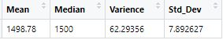
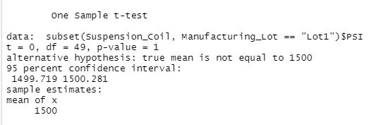

# MechaCar_Statistical_Analysis
A use of R to analyze car and suspension coil data.

## Linear Regression to Predict MPG - Deliverable 1

Which variables/coefficients provided a non-random amount of variance to the mpg values in the dataset?
- The two variables providing the most varience to the mpg values are the vehicle length and the ground clearance, as shown below. This is shown in the Pr(>|t|) values of the summary, being too large to be a random coralation.

Is the slope of the linear model considered to be zero? Why or why not?
- If we look at our p-value of 5.35e-11, it is significantly smaller than the R-squared value of 0.7149. Which means that the slope of our linear model is not zero.

Does this linear model predict mpg of MechaCar prototypes effectively? Why or why not?
- The R-squared value we've found, 0.7149, meaning that the model would be considered effective in predicting the mpg.

## Summary Statistics on Suspension Coils

The design specifications for the MechaCar suspension coils dictate that the variance of the suspension coils must not exceed 100 pounds per square inch. Does the current manufacturing data meet this design specification for all manufacturing lots in total and each lot individually? Why or why not?

- In the total we can see in the varience is only approximately 62, so it would meet the design specification of less than 100.

- But if we take a look at the individual lots, we can see that lot 3 is actually at a varience of 170, putting it well outside the design specification of less than 100. While lots 1 and 2 were still within those design specifications.

## T-Tests on Suspension Coils

In the total t-test the p-value we find is 0.060, meaning that all lots are not significantly different than the popluation mean in total.

If we measure the lots indavidually though, we can find out more information about them. 

- We see that lot 1 is not significantly different than the popluation mean with a p-vaalue of 1.

- We see that lot 2 is not significantly different than the popluation mean with a p-vaalue of 0.60.

- But we see that lot 3 is in fact significantly different than the popluation mean with a p-vaalue of 0.042.

## Study Design: MechaCar vs Competition

- One of the best metrics to measure when trying to compare to the competition is cost as well as cost of maintenance. If you can already look into the mpg of the MechaCar and compare that to the competition, it allows you to factor that into the upfront cost and think about the long term benafits vs the initial costs. 

- The Null hypothesis would be that there is no significant difference between costs of the MechaCar and the competition, while the Alternative hypothesis would be that there is in fact a difference.

- The best way to test the costs would be a summary table, as it would give a vary neat visualisation of the costs of both the MechaCar and the compatition, making a comparison much easier to do. This could.

- In addition to the data we have, the most important data needed to run this test is of course the different costs of the MechaCar across several lots, as well as the costs of many competition cars. This way you could look at the costs of the cars as well as compare the levels of preformance and better make a decision from there. 
